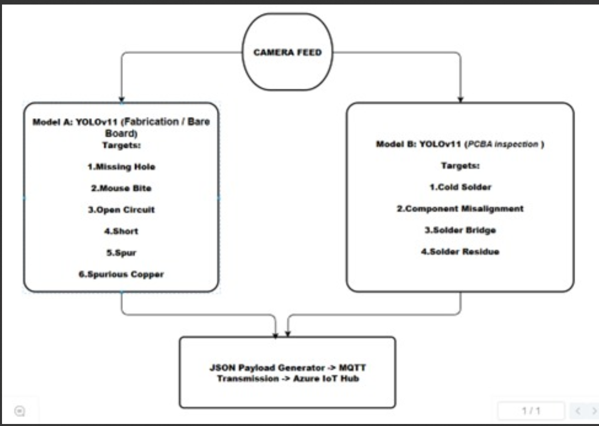

# pcb-defect-detection-yolov11-iot

Dual-stage PCB defect detection (Fabrication + Assembly) using YOLOv11, ONNX, and Azure IoT Telemetry.

---

## Project Highlights: An Industry-Ready Smart Inspection System

This is not just an object detection model—it is a complete industrial automation solution designed to solve real manufacturing challenges with speed, precision, and scalability.

### 1. Solves a Core Industrial Problem

Traditional PCB inspection is slow, expensive, and often inaccurate.  
This system provides a software-defined, adaptable alternative that:

- Reduces reliance on costly AOI hardware  
- Increases throughput with real-time inference  
- Improves consistency by eliminating operator fatigue  
- Adapts instantly to new defect types without expensive retooling  

---

## System Architecture



---

## 2. Strategic Dual-Model Architecture

The inspection pipeline is intentionally decoupled into two specialized stages to address the fundamentally different requirements of PCB fabrication and PCB assembly.  
This avoids the accuracy trade-offs and instability that occur in monolithic single-model systems.

### Model A — Fabrication Stage (High Precision Optimization)

**Role:** Inspects raw bare boards immediately after the etching process  
**Key Metric:** 94.88% Precision  

**Technical Objective:**

- Minimize False Positives  
- Prevent rejection of functional boards  
- Maximize material yield  

**Why Precision Matters Here**

Fabrication defects are relatively sparse but critical. Over-flagging good boards increases scrap cost and disrupts production.  
Model A acts as a **Yield Guardian**, ensuring that only truly defective bare boards are flagged.

---

### Model B — Assembly Stage (High Recall Optimization)

**Role:** Inspects component-mounted PCBs after reflow soldering  
**Key Metric:** 91.33% Recall  

**Technical Objective:**

- Minimize False Negatives  
- Ensure no defective boards escape to customers  
- Maximize final product reliability  

**Why Recall Matters Here**

Missing a solder or placement defect can cause field failures, returns, and warranty costs.  
Model B acts as a **Risk Mitigator**, ensuring that critical assembly defects are not overlooked.

---

### Why a Dual-Model Approach?

- Fabrication and Assembly defects have different visual patterns, defect distributions, and business risks.  
- A single model tuned for one stage will underperform on the other.  
- Using two specialized models allows independent optimization of decision thresholds:  
  - Model A is tuned for **strict precision**.  
  - Model B is tuned for **strict recall**.  
- This architecture mirrors real SMT production lines, making the system closer to an industry-ready AOI replacement rather than an academic demo.

---

## 3. Full Edge-to-Cloud Integration (Digital Twin Architecture)

The system extends beyond local inference to establish a closed-loop data pipeline from edge devices to the cloud, enabling a production-line Digital Twin.

### Edge Logic & Action Mapping

Inference outputs from the YOLOv11 models are processed via a deterministic control script:

- Raw class labels are mapped to specific maintenance or inspection instructions.  
- The system produces **operational recommendations**, not just bounding boxes.

**Example Logic**

```text
If class == "Missing Hole" → Output: "Check CNC Drill Bit"
If class == "Solder Bridge" → Output: "Apply Flux & Reflow"

### 4. Engineered for the Factory Floor

This system is optimized for real-world deployment:

- **78.5 FPS** throughput suitable for high-speed conveyors  
- ONNX-exported models enabling low-latency inference on edge devices  
- Works on Jetson boards, Raspberry Pi, and other lightweight edge hardware  

---

### Why This Matters

This project demonstrates a holistic engineering skillset combining:

- Deep Learning (YOLOv11, custom training)  
- Smart Instrumentation (sensor-based inspection)  
- Control Systems (feedback and corrective logic)  
- Industrial IoT (Azure, MQTT, real-time telemetry)  
- Edge Computing (ONNX optimization for deployment)  

The result is a practical, scalable, and industry-grade inspection system ready for modern manufacturing environments.
