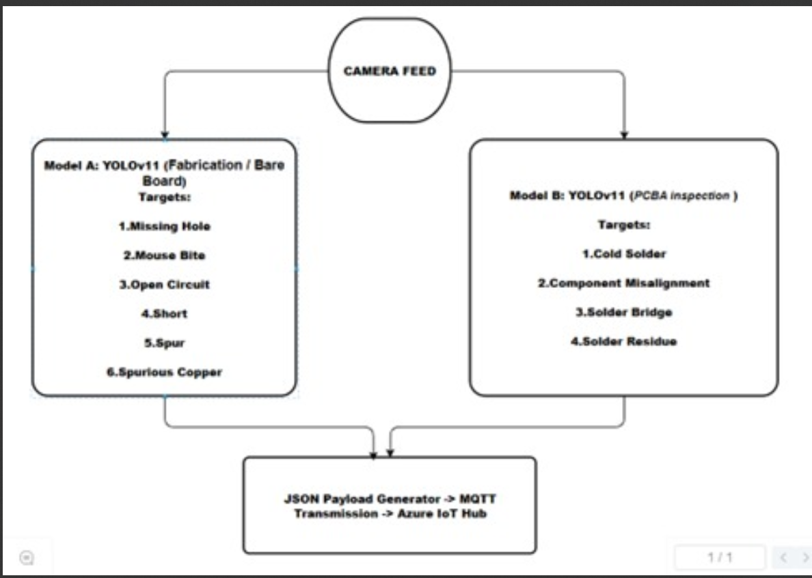

# Dual-Stage PCB Defect Detection using YOLOv11 & IoT

**Faculty-Guided Project · National Institute of Technology, Tiruchirappalli**

A computer-vision-based inspection system for detecting defects across two stages of PCB manufacturing: **bare-board fabrication** and **populated-board assembly**.

The project uses separate YOLOv11 models for the two inspection stages, followed by defect-to-corrective-action mapping and IoT-based telemetry for communicating inspection results.

---

## Overview

PCB inspection involves different types of defects depending on the stage of manufacturing.

Instead of treating PCB inspection as a single detection problem, this project separates it into two stages:

### Stage 1 — Fabrication Inspection

Inspection of **bare PCBs** for fabrication-related defects.

The fabrication model was designed with an emphasis on **precision**, helping reduce unnecessary rejection of boards caused by false-positive detections.

### Stage 2 — Assembly Inspection

Inspection of **populated PCBs** after component placement and soldering.

The assembly model places greater emphasis on **recall**, since missing a potentially important assembly defect can be more significant than generating an additional inspection alert.

Together, the two models form a dual-stage PCB inspection pipeline.

---

## System Architecture



The overall workflow is:

**PCB Image → Inspection Stage → YOLOv11 Detection → Defect Classification → Corrective-Action Mapping → IoT Telemetry**

The two inspection stages operate using independently trained models so that their behaviour can be evaluated and optimized separately.

---

## Dataset

The combined dataset contains:

| Parameter | Value |
|---|---:|
| Total Images | **1,698** |
| Fabrication Images | **741** |
| Assembly Images | **957** |
| Total Defect Classes | **10** |

The dataset was divided between fabrication and assembly inspection tasks according to the corresponding defect type.

---

## Model Development

Two YOLOv11 models were developed.

### Model A — Fabrication Defect Detection

**Architecture:** YOLOv11s

The fabrication model was selected with an emphasis on precision.

**Precision: 94.88%**

This helps reduce false-positive detections during bare-PCB inspection.

### Model B — Assembly Defect Detection

**Architecture:** YOLOv11n

The assembly model was evaluated with greater emphasis on recall.

**Recall: 91.33%**

This helps reduce the likelihood of assembly defects being missed during inspection.

---

## Overall Performance

Across the complete dual-stage system:

| Metric | Result |
|---|---:|
| mAP@0.5 | **91.12%** |
| Precision | **91.36%** |
| Recall | **90.53%** |
| Inference Throughput | **78.5 FPS** |
| Defect Classes | **10** |

These results were obtained during evaluation of the project datasets and models.

---

## Detection Results

The trained models detect and localize PCB defects using bounding boxes and class predictions.

Representative outputs from the fabrication and assembly models are available in the [`results`](results/) directory.

The two-stage design allows fabrication and assembly defects to be evaluated independently rather than forcing both inspection tasks into a single model.

---

## IoT Telemetry & Corrective-Action Mapping

The vision pipeline was extended beyond defect detection to structure the model outputs for IoT-based reporting.

Detected defect classes are mapped to corresponding corrective or inspection actions.

For example:

```text
Detected Defect
        ↓
Defect Classification
        ↓
Corrective-Action Mapping
        ↓
Structured JSON Payload
        ↓
MQTT / Azure IoT Hub
```

The telemetry pipeline is implemented in:

```text
iot_telemetry_pipeline.py
```

This enables model predictions to be converted into structured information that can be communicated to an IoT platform.

---

## Example Telemetry Structure

A detection can be represented using structured data containing information such as:

```json
{
  "inspection_stage": "assembly",
  "defect": "solder_bridge",
  "confidence": 0.94,
  "corrective_action": "inspect solder joints and remove excess solder"
}
```

The exact output depends on the detected defect and the corresponding corrective-action mapping.

---

## ONNX Deployment Evaluation

The trained models were also evaluated after conversion to **ONNX** to investigate deployment-oriented inference performance.

For Model A, inference time improved from approximately:

**15.4 ms → 8.2 ms**

However, the same improvement was not observed for Model B:

**PyTorch: 31.11 ms**  
**ONNX: 37.76 ms**

This showed that conversion to ONNX does not automatically guarantee faster inference for every model and that deployment performance should be benchmarked separately for each architecture and target environment.

---

## Skillset

### Computer Vision & Machine Learning

- YOLOv11
- PyTorch
- OpenCV
- ONNX
- Object Detection
- Model Training & Evaluation

### IoT

- Azure IoT Device SDK
- Azure IoT Hub
- MQTT
- JSON Telemetry
- Defect-to-Corrective-Action Mapping

### Programming & Development

- Python
- Jupyter Notebook
- Git / GitHub

### Engineering

- PCB Defect Inspection
- Fabrication Defect Detection
- Assembly Defect Detection
- Edge-to-Cloud Telemetry
- Deployment-Oriented Model Evaluation

---

## Repository Structure

```text
pcb-defect-detection-yolov11-iot/
│
├── models/
│   └── Trained / exported model files
│
├── notebooks/
│   └── Model development and evaluation notebooks
│
├── results/
│   └── Detection and evaluation outputs
│
├── iot_telemetry_pipeline.py
│   └── Defect telemetry and corrective-action mapping
│
├── system_architecture.png
│   └── Overall system architecture
│
└── README.md
```

---

## Key Engineering Takeaways

This project provided experience across the complete development pipeline:

- Framing one manufacturing problem as two separate computer-vision tasks
- Preparing datasets for object detection
- Training and evaluating YOLOv11 models
- Comparing precision and recall requirements for different inspection stages
- Evaluating model inference performance
- Converting models to ONNX
- Benchmarking deployment performance
- Structuring model predictions for IoT communication
- Mapping detected defects to corrective actions
- Integrating computer vision with an IoT telemetry pipeline

---


## Project Context

This project was carried out as a **faculty-guided project at the National Institute of Technology, Tiruchirappalli (NIT Trichy)**.

It was developed outside regular coursework as an exploration of computer vision and IoT-based automated inspection.

---

## Author

**Padma Muthu Lakshmanan**  
B.Tech — Instrumentation & Control Engineering  
National Institute of Technology, Tiruchirappalli

[GitHub](https://github.com/Padma1320)
